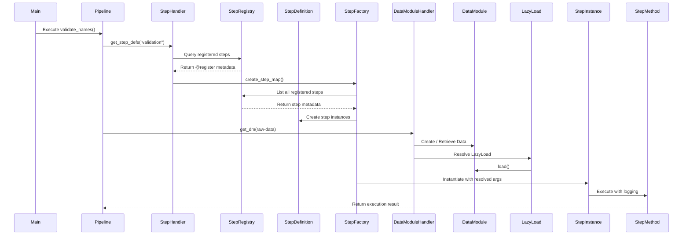
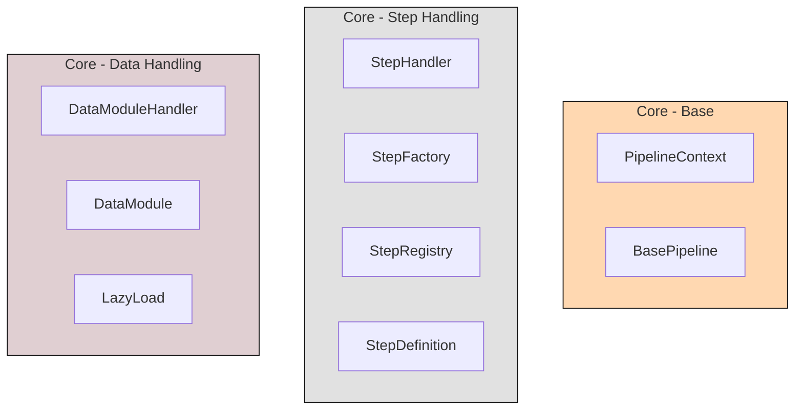
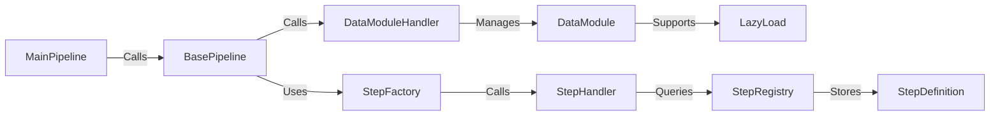
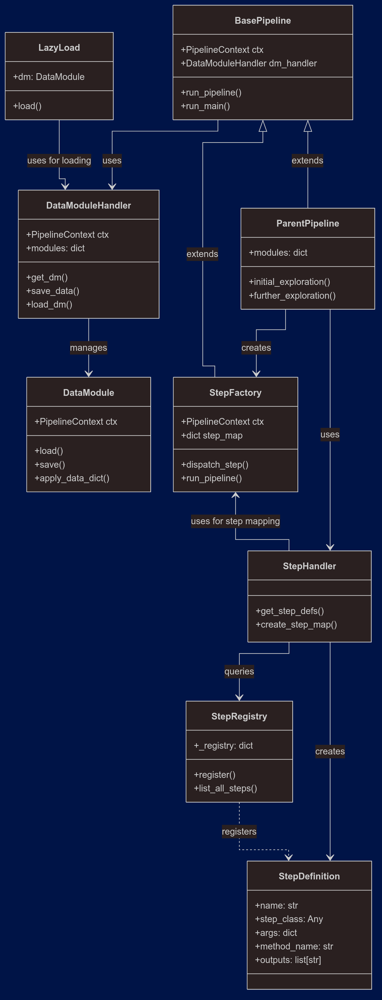

# README

### **Workflow Dependency - Pipeline Execution Chain**
- **Data Initialisation:**
  - Uses DataModuleHandler to retrieve DataModules
  - Data modules stored in a dictionary
  - Supports LazyLoading through the StepDefinitions
- **Step Resolution:**
  - StepHandler retrieves StepDefinitions from ``src/pipelines/steps/*_steps.py``
  - Converts to StepDefinition objects
- **Execution Orchestration:**
  - StepFactory receives mapped StepDefinitions
  - Runs steps in order using `run_pipeline()` for complex flows with checkpoints
  - Runs steps in order using `run_main()` for linear executions (`main.py`)
- **Step Registration:**
  - Steps are declared in ``src/pipeline/steps/*_steps.py`` using decorators
  - Metadata is preserved in ``steps_metadata.json`` for debugging and visibility

**Workflow Result**:
1. **Loose Coupling:** Components interact through well-defined interfaces
2. **Late Binding:** Data loading deffered until step execution
3. **Discovery:** All steps visible via `StepRegistry.list_all_steps()`
4. **Reusability:** Step definitions shared across pipelines via registry

